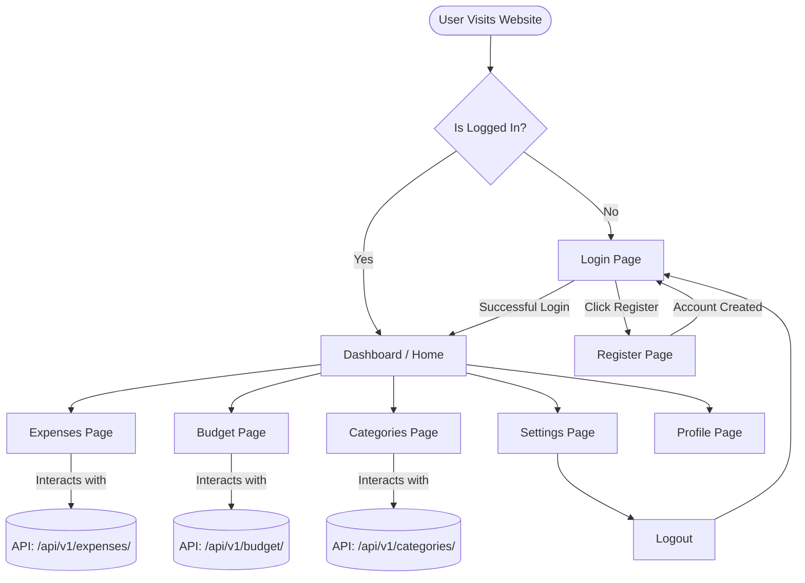

# Website User Flow

This flowchart represents the user journey and navigation flow of the ExpenseIQ website, based on the route configurations in `config/urls.py`.

```mermaid
graph TD
    Start([User Visits Website]) --> AuthCheck{Is Logged In?}
    
    AuthCheck -- No --> Login[Login Page]
    AuthCheck -- Yes --> Dashboard[Dashboard / Home]

    Login -->|Click Register| Register[Register Page]
    Register -->|Account Created| Login
    Login -->|Successful Login| Dashboard

    Dashboard --> Expenses[Expenses Page]
    Dashboard --> Budget[Budget Page]
    Dashboard --> Categories[Categories Page]
    Dashboard --> Settings[Settings Page]
    Dashboard --> Profile[Profile Page]

    Expenses -->|Interacts with| API_Exp[(API: /api/v1/expenses/)]
    Budget -->|Interacts with| API_Bud[(API: /api/v1/budget/)]
    Categories -->|Interacts with| API_Cat[(API: /api/v1/categories/)]

    Settings --> Logout[Logout]
    Logout --> Login
```
